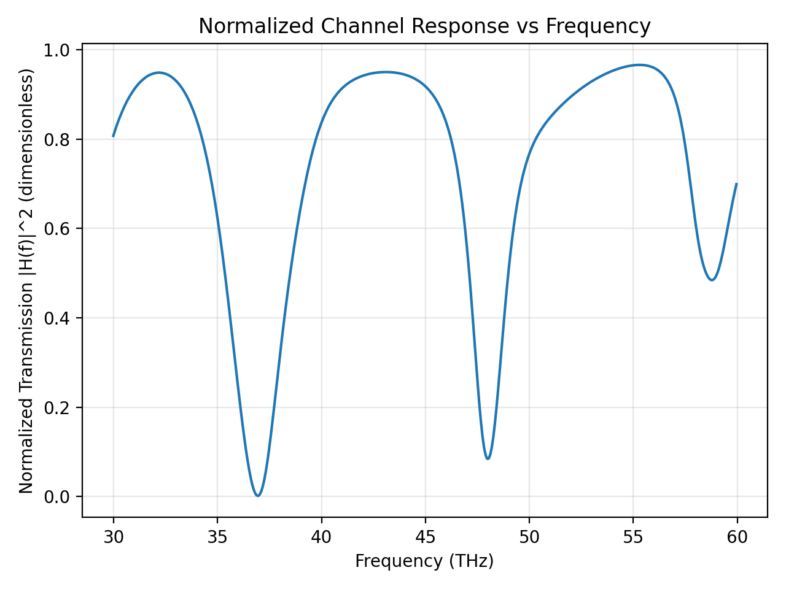
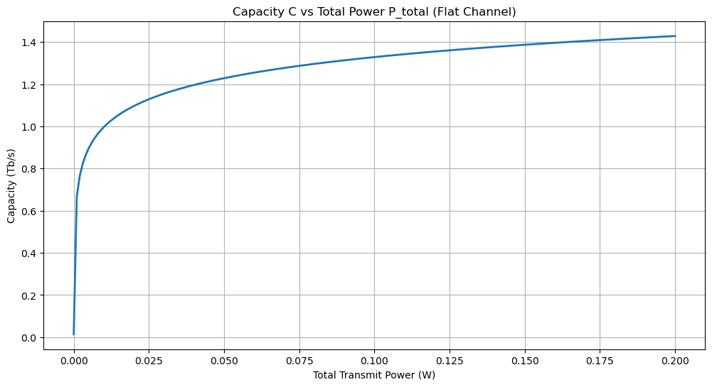

# Shannon-Hartley Capacity Analysis for Photonic Channels

Deriving channel capacity from first-principles electromagnetic simulation using FDTD and applying optimal power allocation via water-filling.



## Overview

This project bridges computational electromagnetics and information theory by:

1. **Simulating photonic structures** using Meep (FDTD) to extract frequency-dependent transmission |H(f)|²
2. **Computing channel capacity** using the Shannon-Hartley theorem for frequency-selective channels
3. **Optimizing power allocation** using the water-filling algorithm to maximize capacity under power constraints

Instead of assuming idealized channel models, the frequency response is derived directly from the physics of the photonic device.

## Key Results

### Diminishing Returns on Power



Channel capacity follows C = B·log₂(1 + SNR), meaning most capacity is achieved at low power levels with rapidly diminishing returns—a fundamental constraint in power-limited optical systems.

### Resonator-Induced Channel Response

A microring resonator side-coupled to a silicon waveguide creates frequency-selective transmission with sharp resonance dips (whispering gallery mode coupling). The normalized |H(f)|² shows multiple resonances across the 30-60 THz band.

### Water-Filling Optimization

For non-flat channels with interference, water-filling allocation outperforms uniform power distribution by avoiding lossy frequency bins and concentrating power where the channel is favorable.

## Project Structure

```
├── simulations/
│   ├── slab.py              # Basic dielectric slab (validation)
│   └── wg_straight.py       # Silicon photonics waveguide at 1.55 µm
├── analysis/
│   ├── shanhartcalc.py      # Basic Shannon-Hartley calculator
│   ├── shanhartcalcV2.py    # With channel notch + interference + water-filling
│   └── hf_pipeline.py       # Full FDTD → capacity pipeline
├── figures/
│   └── ...                  # Generated plots
└── data/
    └── meep_channel_physical.npz  # Simulation output (frequency, |H|², etc.)
```

## Requirements

- Python 3.8+
- [Meep](https://meep.readthedocs.io/) (MIT FDTD solver)
- NumPy
- Matplotlib

```bash
# Meep installation (Ubuntu/Debian)
conda install -c conda-forge pymeep

# Or via pip (may require additional dependencies)
pip install meep
```

## Usage

### Run the full pipeline

```bash
# Extract |H(f)|² from Meep simulation
python analysis/hf_pipeline.py

# Output: meep_channel_physical.npz + figures
```

### Water-filling demonstration

```bash
python analysis/shanhartcalcV2.py
```

Example output:
```
Baseline Capacity: 1.23e9 bits/s
Water Filled Capacity: 1.41e9 bits/s  
Capacity Gain Factor: 1.15x
```

## Theory

### Shannon-Hartley for Frequency-Selective Channels

For a channel with frequency-dependent gain |H(f)|² and noise PSD N(f), the capacity is:

```
C = ∫ log₂(1 + |H(f)|² · S(f) / N(f)) df
```

where S(f) is the transmitted power spectral density, subject to total power constraint ∫S(f)df = P.

### Water-Filling Solution

The optimal power allocation is:

```
S(f) = max(0, μ - N(f)/|H(f)|²)
```

where μ is chosen to satisfy the power constraint. Power "fills" favorable frequencies first, avoiding bins where the channel is poor.

## Future Work

- [ ] Multi-resonator geometries for engineered channel responses
- [ ] Capacity comparison across different photonic filter designs
- [ ] Integration with wavelength-division multiplexing (WDM) optimization

## License

MIT

## Author

Connor — Ontario, Canada

## Acknowledgments

- [Meep](https://meep.readthedocs.io/) — MIT Photonics
- Shannon, C.E. (1948). "A Mathematical Theory of Communication"
